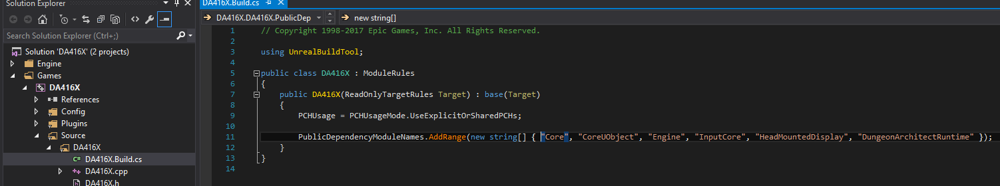

Project Setup
=============

Add Dungeon Architect to your game project's Build.cs file so you can access the plugin



Open the file `**Source/PROJECT_NAME/PROJECT_NAME.Build.cs**`

Add **`DungeonArchitectRuntime`** to the list of `PublicDependencyModuleNames`

```
// Copyright 1998-2017 Epic Games, Inc. All Rights Reserved.

using UnrealBuildTool;

public class PROJECT_NAME : ModuleRules
{
	public PROJECT_NAME(ReadOnlyTargetRules Target) : base(Target)
	{
		PCHUsage = PCHUsageMode.UseExplicitOrSharedPCHs;

		PublicDependencyModuleNames.AddRange(new string[] { "Core", "CoreUObject", "Engine", "InputCore", "HeadMountedDisplay",
			"DungeonArchitectRuntime" });
	}
}
```

